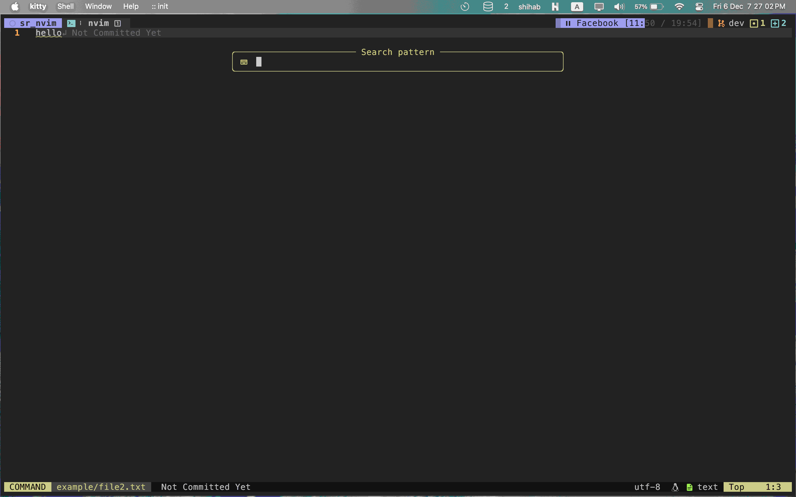

# sr.nvim

Telescope-powered multi-file search & replace plugin for Neovim.



## Features

-   🔍 Global search and replace across multiple files
-   📝 Live preview of changes through Telescope UI
-   🎯 Case sensitive/insensitive search options
-   🔄 Support for plain text and regex patterns
-   💡 Preview changes before applying them
-   ⚡ Fast and lightweight
-   📁 Respects .gitignore files for efficient searching

## Installation

Using [lazy.nvim](https://github.com/folke/lazy.nvim):

```lua
{
    'p-nerd/sr.nvim',
    dependencies = {
        'nvim-telescope/telescope.nvim',
    },
    config = function()
        require('sr').setup({
            keymap = '<leader>sr',
            ignore_case = false,
            use_regex = false,
            preview_changes = true,
            live_preview = true,
        })
    end
}
```

Using [packer.nvim](https://github.com/wbthomason/packer.nvim):

```lua
use {
    'p-nerd/sr.nvim',
    requires = {'nvim-telescope/telescope.nvim'},
    config = function()
        require('sr').setup({
            keymap = '<leader>sr',
            ignore_case = false,
            use_regex = false,
            preview_changes = true,
            live_preview = true,
        })
    end
}
```

## File Exclusions

sr.nvim automatically respects your project's .gitignore file when performing searches. This means:

-   Files and directories listed in .gitignore are automatically excluded from search results
-   Generated files, build artifacts, and other ignored paths won't appear in your search results
-   No additional configuration needed - it works out of the box with your existing .gitignore settings

## Configuration

Default configuration:

```lua
require('sr').setup({
    keymap = '<leader>sr',      -- default keymap to trigger search & replace
    ignore_case = false,        -- case sensitive by default
    use_regex = false,          -- use plain text search by default
    preview_changes = true,     -- preview changes before applying
    live_preview = true,        -- show live preview in telescope
})
```

## Usage

1. Press `<leader>sr` (or your configured keymap) to open the search interface
2. Enter your search term
3. Enter replacement text
4. Use Telescope interface to:
    - Preview changes in real-time
    - Select/deselect files to include in the replacement
    - Apply changes with `<CR>`
    - Cancel with `<Esc>`

### Plain Text Search

By default, the plugin uses plain text search. This means special characters are treated literally:

```
Search: old_function
Replace: new_function
```

### Regex Search

Enable regex mode in the setup or toggle it during search:

```lua
-- In setup
require('sr').setup({
    use_regex = true
})

-- Example regex search
Search: \b\w+_function\b
Replace: new_function
```

## License

MIT License - see the [LICENSE](LICENSE) file for details.
